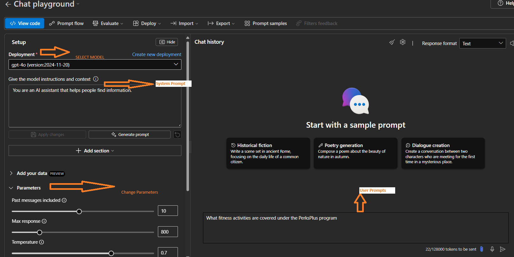
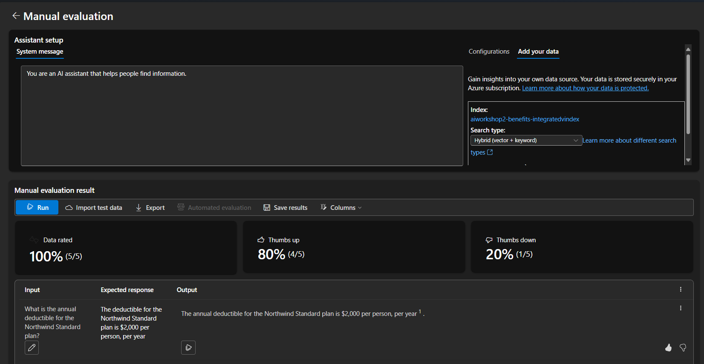
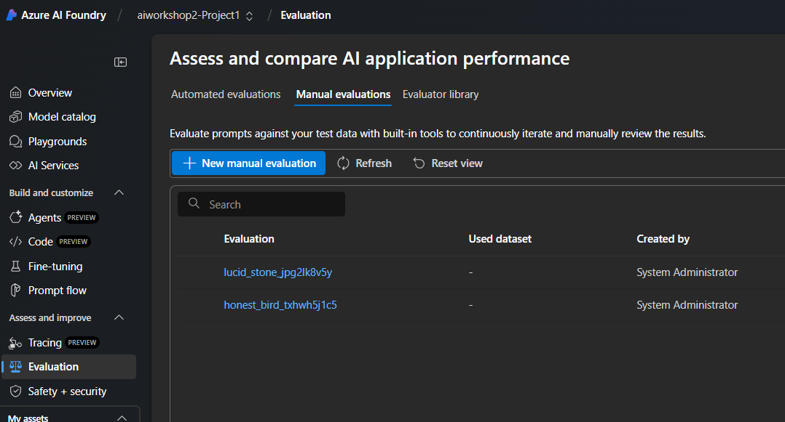
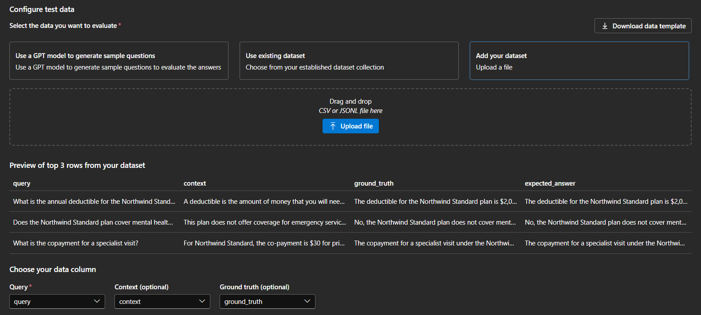
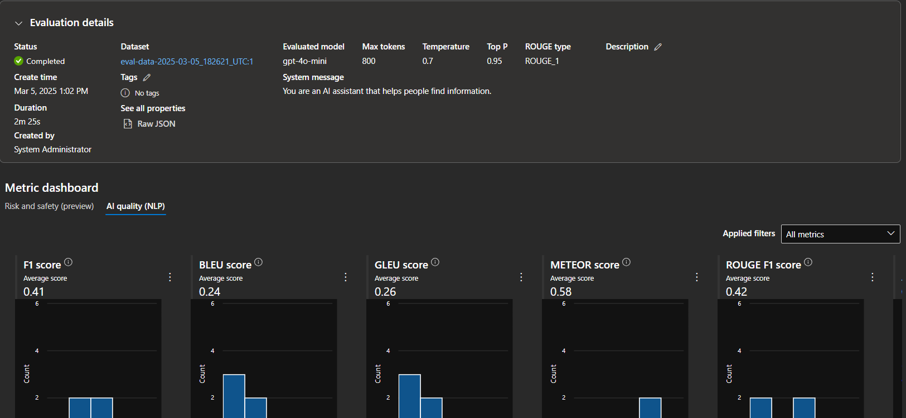

# Evaluate the performance of your application in the Azure AI Foundry

This exercise will guide you through exploring Manual and Automatic evaluations to assess and compare the performance of your AI applications using the Azure AI Foundry portal. 

## Prerequisites
- Create an AI hub and project in the Azure AI Foundry
- Deploy a LLM/SLM model

## Manually evaluate your application in the Azure AI Foundry portal Playground

- Follow instructions in section 1.2 and 1.3 to manually evaluate your RAG application using prompt engineering and add your data/index. 

- Refer system prompt and prompt engineering guidance provided in section 1.2 to try and compare responses from  different models by comparing their responses to specific prompts relevant to your use case. 

    

- Chat Playground is great way to manually evaluate few prompts and make sure you receive expected response from the model and attached data/index.

## Use Manual Evaluation option to evaluate in bulk

You can use Manual evaluation option to feed more than one prompts at a time to the LLM (or RAG pattern) and get the results in bulk mode. 

1. In the **Chat playground**, select the **Evaluate** dropdown from the top bar, and choose **Manual evaluation**.
2. You can change the default **System message** to specific system message for your use case.
3. Make sure to change the Configuration pointing to the model and change parameters. 
4. Click on *Add your data* tab and select "aiworkshop-benefits-integratedvindex" you have created in section 1.3 
5. In the **Manual evaluation result** section, add the following five questions as separate **Inputs**:

   - Input: What is the annual deductible for the Northwind Standard plan?
   - Expected response: The deductible for the Northwind Standard plan is $2,000 per person, per year.

   - Input: What is the copayment in Northwind Standard plan for a specialist visit?
   - Expected response: The copayment for a specialist visit under the Northwind Standard plan is $50

   - Input: Are preventive care services covered?
   - Expected response: Yes, preventive care services are covered at 100% under the Northwind Standard plan

   - Input: Does Perksplus cover horseback riding?
   - Expected response: Yes, Perksplus covers horsebackriding

   - Input: Do we have holiday on President's day?
   - Expected response: Yes, President's Day is a holiday according to the Contoso Electronics Holidays Calendar for 2025. It falls on February 17th.

*Alternatively, you can also upload csv or jsonl file with these columns and import this data using **Import test data** option*  
   
6. Select **Run** from the top bar to generate outputs for all questions.

7. Manually review the outputs for each question by selecting the thumbs up or down icon at the bottom right of a response. 
8. Based on your review/feedback you will see score on the screen. 

8. Select **Save results** from the top bar. Enter `manual_evaluation_results` as the name for the results.
7. Navigate to **Evaluation** using the left menu.
8. Select the **Manual evaluations** tab to find the manual evaluations you just saved.

## Evaluate your Application with Automatic Evaluations

You can use Automated evaluations and generate metrics for each data row in your test datasets.

You can choose one or more evaluation metrics to assess the output from different aspects. 

You can create an evaluation run from the evaluation, model catalog or prompt flow pages in Azure AI Foundry portal. 

Then an evaluation creation wizard appears to guide you through the process of setting up an evaluation run.

1. Select the **Automated evaluations** tab and create a **New evaluation** :

   

2. Select below *Model and prompt* option on the **What do you want to evaluate?** popup. 
3. Refer below screenshot for details about
   - **Evaluation name**: *Enter a unique name*
   - **Deployment**: *Choose model you have deployed for evaluation*
   - Set up parameters or keep them as default. 
   - Update System prompt 
   - For **Select the data you want to evaluate**: Add your dataset
   - Use any test datasets (.jsonl files) available in the data folder and upload it to the UI.
   - Once you upload file, you will see top 3 rows/prompts gets loaded on the screen as shown below: 
   
   

   - Make sure data column mapping is set as below:

   

4. Choose all 2 type of evaluations AI quality(NLP) and Risk and safety(AI assisted) as shown below : 

         

   **Importnat Note:**
   - *Risk/Safety evaluations are in preview may not be available in only few regions at the time of creating these instructions. So please check if it is available in your region* 
   - *If you select AI Quality (AI assisted) evaluation, make sure to select GPT 4/4o or 4o-mini models or any other supported models as a judge. Not all models are supported and can be used as a Judge. Please refer latest documentation (added in references) for details.
   Also, at the time of creation of these instructions, this option would require key based authentication for AOAI model connection. So, you will have to do changes to the connections to use key authentication instead of Entra ID. (This requirement may change in future)*

5. Click **Create**, to create and submit your evaluations.

8. Wait for the evaluations to complete, refreshing if necessary. This step may require few minutes to execute as required compute is created and evaluations are executed on that compute. At the end of successful evaluation completion, you will be able to access all the metrics on *Report* tab and details of evaluations on *data* tab. 

   
   

9. Explore the **Metric dashboard** and **Data** for more details.

10. You can also export results using *Export Result" option. 

###  References: 

https://learn.microsoft.com/en-us/azure/ai-foundry/concepts/evaluation-approach-gen-ai

https://learn.microsoft.com/en-us/azure/ai-foundry/how-to/evaluate-prompts-playground

https://learn.microsoft.com/en-us/azure/ai-foundry/how-to/evaluate-generative-ai-app

