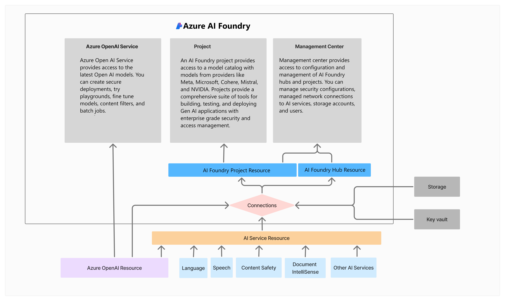

# Project Set up 

##  Important Considerations: 
* Ensure you are using the Contoso - MCAPS Managed environment (some features may not function in the MSFT Non-prod environment).
* Prefer using the East US, East US2, and Sweden Central regions (where all services/models are available)
* Ensure you have sufficient quota available (in case you need to use regional deployments).
* Private networks - out of scope

 AI Foundry Resources 

##  Step-by-Step Guide 
0. Download and unzip *benefits.zip* file from data folder to your local machine. 
1. **Create Hub**
    - Create a new resource group. Create a separate resource group for this exercise. 
    
        *Eg: aiworkshop-rg*

    - Create AI Foundry hub 

        - You can create Hub either from Azure portal or from AI Foundry link directly: https://ai.azure.com/
        - Use naming convention as shown below - 
        
          *Eg: aiworkshop-contosohub*

        Use similar naming convention for other resources *Eg: aiworkshop-storage, aiworkshop-keyvault etc.*

        Please select **managed identity/Entra ID** option for connectivity to storage account. 

    - Set up AI Search and AI Service within this resource group.

        *Eg: aiworkshop-ai-search and aiworkshop-ai-service*
    *Make sure your AI search resource is either Basic or Standard tier. Free comes with limited indexes and features.*

2. **Create Project**
    - Initiate a new project within the created hub.

        *Eg: aiworkshop-contosobuddy-project*

    - Go to the default storage account created and create new container *"data"* 
    - Upload all benefits files from downloaded folder to this container.    
3. **Open Management Center**
    - Access the management center for further configurations.
4. **Add User as Azure AI Developer**
    - Navigate to the users section.
    - Add your user as an Azure AI Developer.
      *this role may not require if you are already owner*

5. **Configure Connected Resources**
    - Go to Connected Resources.
    - For each connected resource, edit the access details.
    - Change the authentication method to use Microsoft Entra ID.
    - (Optional) Restrict access to be used only by the hub you created.
    - Update the access details.
6. **Configure Search and AI Services**
    - Go to Search Services and AI Services on the portal.
    - Ensure you are using the same resource as in the connected resources.
    - Under Settings and Identity, enable it and save the changes.
7. **Set Up API Access Control**
    - Go to Search Services.
    - Under Settings and Keys, set up API access control and choose both.
8. **Assign Roles in Search Service**
    - Still under Search Service, go to Access Control (IAM).
    - Add the following roles:

    | Resource | Role | Assignee |
    | --- | --- | --- |
    | Azure AI Search | Search Index Data Contributor | Azure AI services/OpenAI |
    | Azure AI Search | Search Service Contributor | Azure AI services/OpenAI |
    | Azure AI Search | Search Index Data Contributor | User |
    | Azure AI Search | Search Service Contributor | User |

9. **Assign Roles in Azure AI Services**
    - Go to Azure AI services within your resource group.
    - Add the following roles:

    | Resource | Role | Assignee |
    | --- | --- | --- |
    | Azure AI services/OpenAI | Cognitive Services Contributor | Azure AI Search |
    | Azure AI services/OpenAI | Cognitive Services OpenAI Contributor | Azure AI Search |
    | Azure AI services/OpenAI | Cognitive Service Contributor | User |
    | Azure AI services/OpenAI | Cognitive Service OpenAI Contributor | User |

10. **Configure Storage Account**
    - Go to the Storage Account under your resource group.
    - Under Settings and Configurations, enable Microsoft Entra authorization in the Azure portal and save it.
    - Go to Access Control and add these roles:

    | Resource | Role | Assignee |
    | --- | --- | --- |
    | Azure Storage Account | Storage Blob Data Reader | Azure AI Search |
    | Azure Storage Account | Storage Blob Data Contributor | Azure AI services/OpenAI |
    | Azure Storage Account | Storage Blob Data Contributor | User |
    | Azure Storage Account | Storage Blob Data Reader* | User |

    *Note: We observed issue with auto evaluation step where we have to assign Reader role to use even though Contributor role is present.*

11. **Create Deployment**
    - Create model deployments in your AI foundry project: 
    - GPT 4o    
    - text-embedding-ada-002
    *(or other latest models supported in the region you have selected)*

**Resources outside of AI Foundry:**

Below resources are required for Integrated Vectorization to work. (*Current limitation, but will be fixed very soon by AI search team*)

12. **Azure Open AI resource**

Goto Azure Open AI service and create new Azure Open AI service under same resource group. 

*Eg: aiworkshop-aoai-service*

13. **AI Multi service account**

Create new AI multi service account under same resource group. 
*Eg: aiworkshop-ai-multiservice*

###  References: 
https://learn.microsoft.com/en-us/azure/ai-studio/tutorials/deploy-chat-web-app
https://learn.microsoft.com/en-us/azure/ai-services/openai/how-to/on-your-data-configuration#role-assignments 

