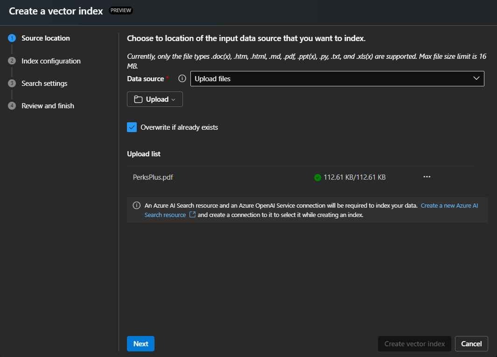
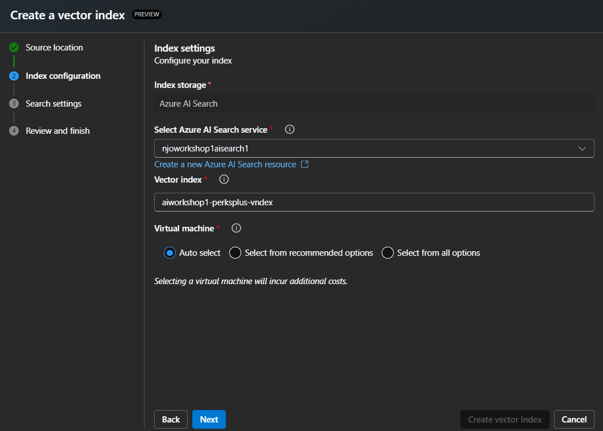
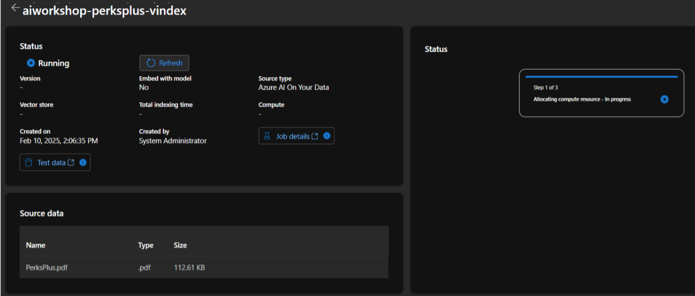
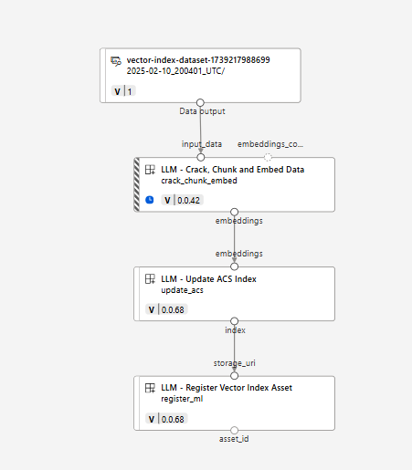
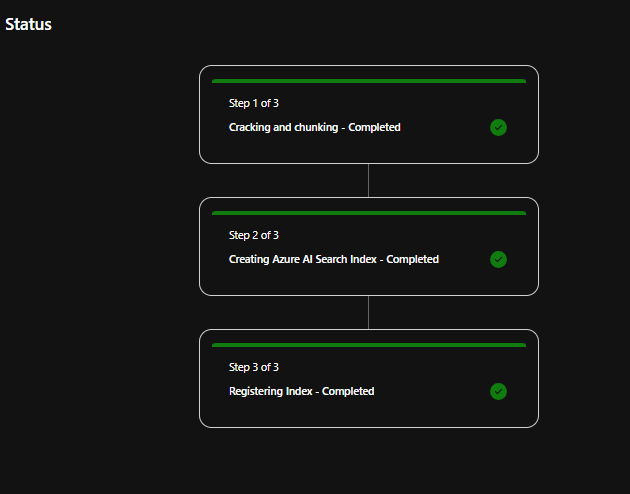
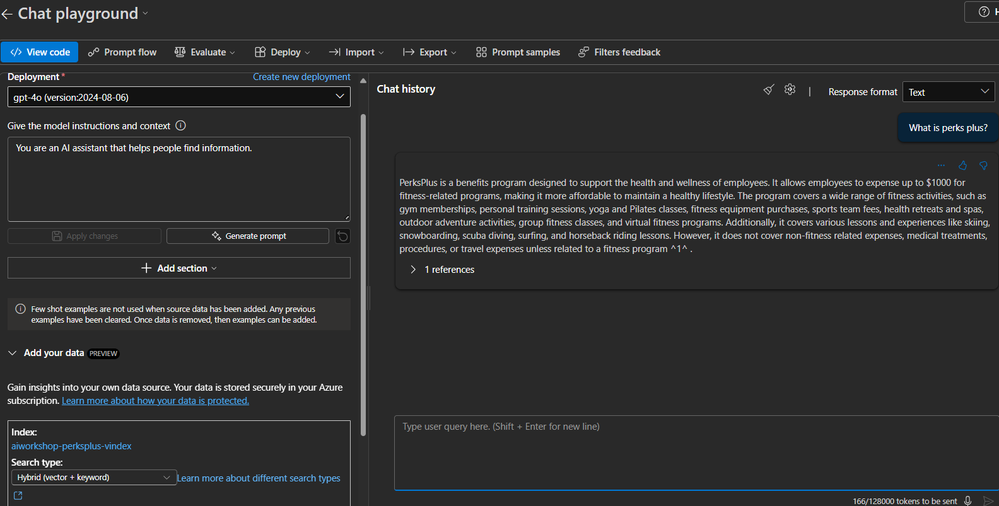

## Exercise 1.3.1:  Creating Vector Index in Foundry 

###  Discussion: Common RAG architecture concepts.

### Pre-requisites: 

* Ensure you have completed all the setup steps specified in section 1.1 (Azure AI Foundry setup)

* The following steps assume you have set up managed identities and assigned all permissions as described in previous sections.

### Instructions: 
1. Access Data and Indexes:

	○ From Foundry project, go to the left-hand side menu and click on "Data and Indexes" under "My Assets."

2. Create a New Index:
	
	○ Click on the "Indexes" tab.
	
	○ Select "New Index" to create a new index.

3. Upload File:
	
	○ From the data source, select the "Upload Files" option.
	
	○ Click on the "Upload File" button.
	
	○ Select the perksplus.pdf file that was downloaded earlier.
	
	○ Click "Next."

    

4. Configure Index:
	
	○ On the index configuration screen, select the AI search service you configured earlier. (Eg: aiworkshop-aisearch)
	
	○ Provide a name for the vector index, such as "aiworkshop-perksplus-vindex"
	
	○ Ensure the virtual machine is set to default and the vector settings are checked.
	
	○ Select the OpenAI service connection created earlier. (eg: aiworkshop-aiservice-aoai)
	
	○ Click on "Create Vector Index."

    

    

5. Monitor Index Creation:
	
	○ The index creation process will take some time.
	
	○ Click on the "Job Details" option to monitor the progress.
	
	○ The Azure Machine Learning Studio will open, showing the job details and steps 
involved.

    

Discussion - Job details and RAG steps.

6. View Job Details:
	
	○ The job will have multiple steps, including data set creation, chunking, embedding, and updating the ACS index.
	
	○ You can view the parameters and outputs for each step.

    

7. Check Index Completion:
	
	○ Once the index creation is complete, you can see the document count and other details in the AI search service.

	

	AI Search Index: 

    

8. Use the Index in Chat Playground:
	
	○ Go to the chat playground.
	
	○ Select "Add Your Data" and choose the newly created index.
	
	○ Use the default or custom prompt to ask questions based on the indexed document.

	○ Example prompts:
		
		• What is perks plus?
		
		• Do you cover swimming through perks plus
		
		• Does perks plus cover under water activities? 

    

###  Discussion:  

*  Upload files vs Upload Folders vs Blob storage. 

*  Pros and Cons of creating indexes from Foundry. 
