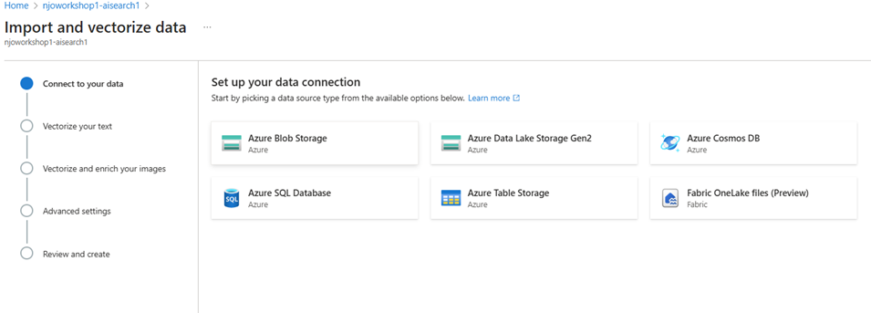
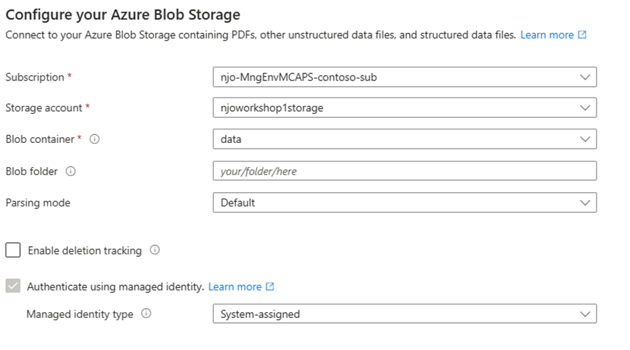
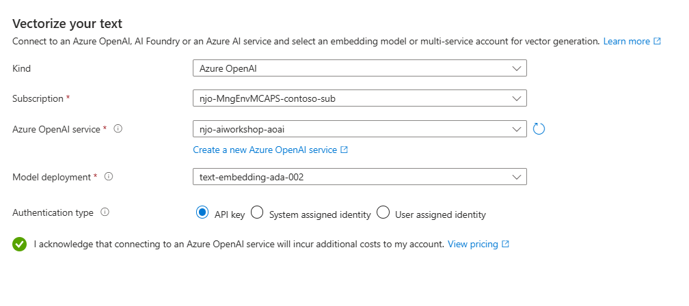
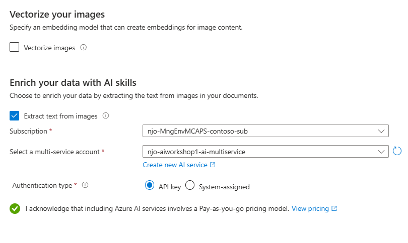
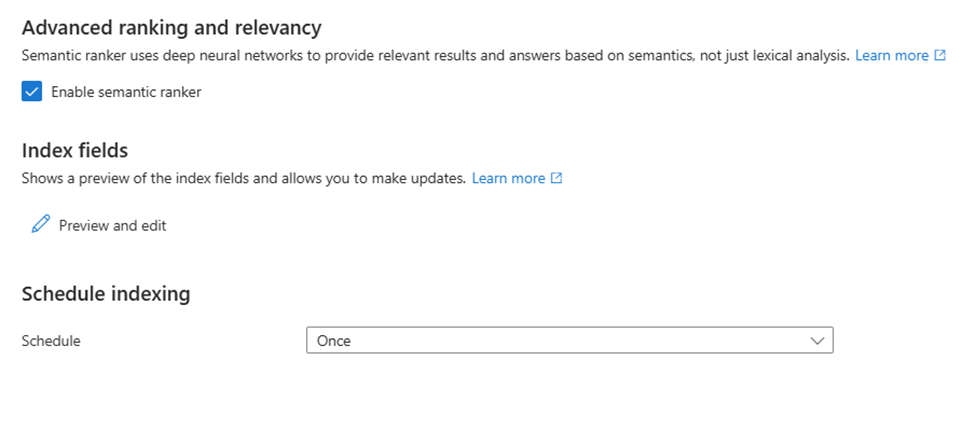
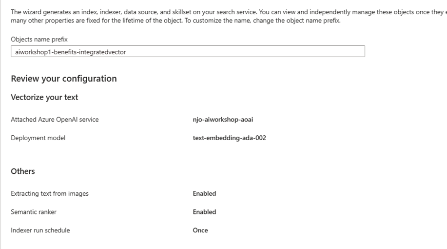
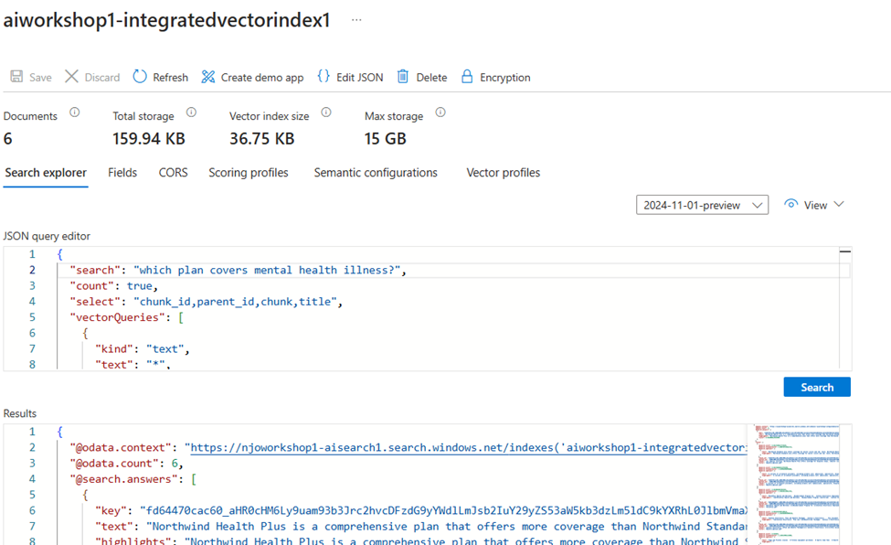
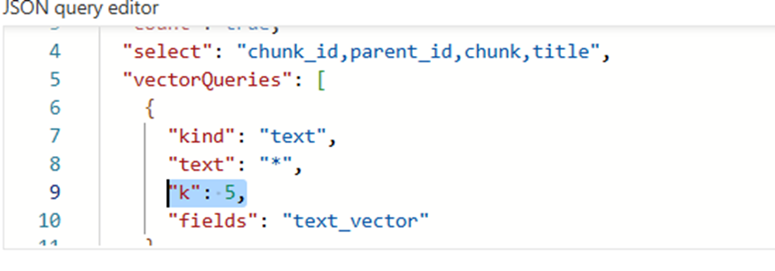
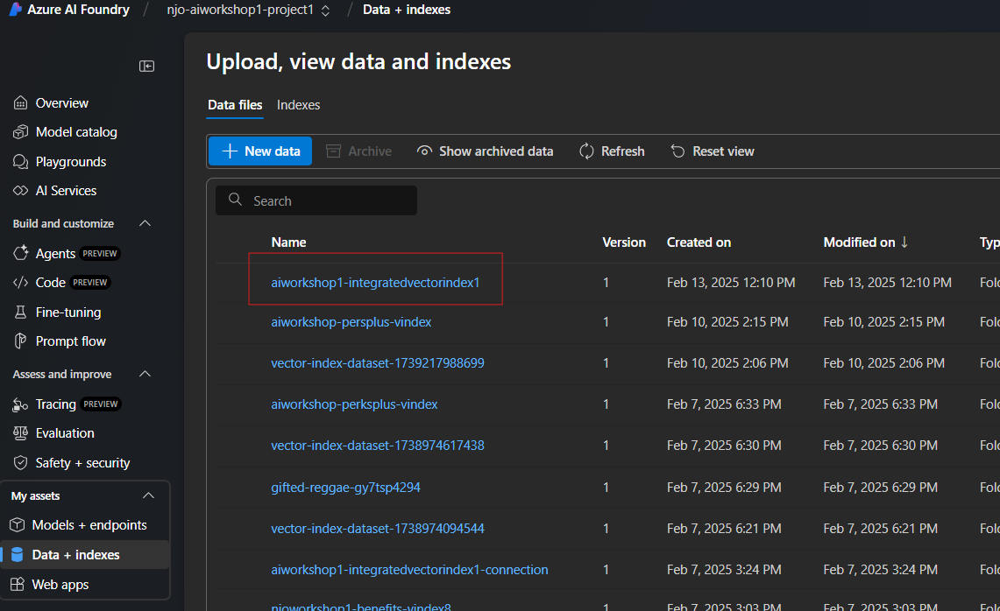
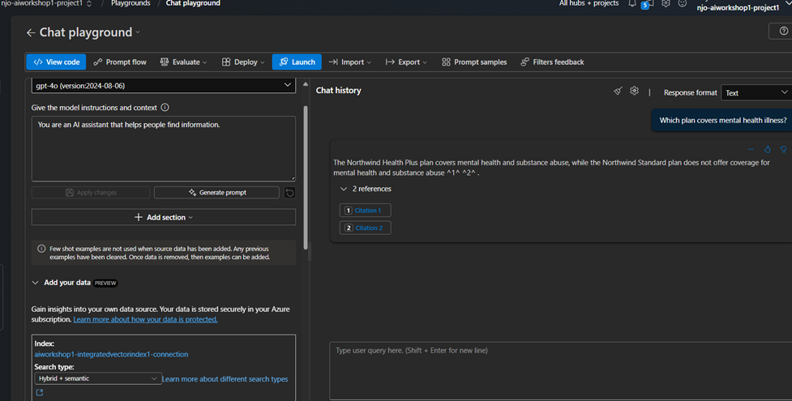

## Exercise 1.3.2:  Integrated Vectorization using Azure AI Search 
This excercise will help you get started with integrated vectorization by using the Import and vectorize data wizard in the Azure portal. 

The wizard chunks your content and calls an embedding model to vectorize content during indexing and for queries.

###  Discussion: AI search - connectivity to AI Foundry models and AI servies! 

### Instructions: 

1.	From Azure portal go to your Azure AI Search service.

2.	On the Overview page, select Import and vectorize data.

    

	#### Connect to your data

3.	Connect to your data, select Azure Blob Storage.

	

4.	Select subscription, storage account & container where you have your benefits data stored. 

	Eg:  Storage account- aiworkshop1storage. Container - data 

	

5.	Keep Enable deletion tracking disabled for this exercise. 

6.	Select Authenticate using Managed Identity option  and identity type as System-assigned managed identity.

	•	The identity should have a Storage Blob Data Reader role on Azure Storage.

	•	Don't skip this step. A connection error occurs during indexing if the wizard can't connect to Azure Storage.

7.	Select Next.

#### Vectorize your text

8.	On the Vectorize your text page, choose the source of the embedding model:

	•	Azure OpenAI

	•	Choose the Azure subscription and open AI service name. Eg: aiworkshop1-aoai and choose embedding model.  text-embedding-ada-002 (or other open AI embedding if you deployed earlier)

9.	Select system-assigned managed identity options to authenticate search service.

	•	The identity should have a Cognitive Services User role on the Azure AI multi-services account.

10.	Select the checkbox that acknowledges the billing effects of using these resources.

	

11.	Select Next.

#### Enrich your data with AI Skills

12.	Keep Vectorize image option disabled as we don’t want to vectorize any images for this exercise. 

13.	Select Extract text from images option – which will add AI Skills to perform OCR and pull text from images. 

14.	Select subscription and multi service AI account created in the same region. Eg: aiworkshop1-ai-multiservice

	

15.	Select acknowledgement checkbox and go to the next step

#### Advanced Settings 

16.	Enable semantic ranker

17.	Click on preview and edit to see index fields (Don’t edit defaults)

18.	Keep schedule = Once and go next

	

#### Review and create

19.	Provide name which will be used as prefix to index, indexer and skills. Eg: aiworkshop1-benefits-integartedvector

	

20.	Review and create index. 

#### Check Results

21.	In the Azure portal, go to Search Management > Indexes, and then select the index that you created.

22.	Search Explorer will open. Select the JSON view.

23.	Replace “*” in the search key to “which plan covers mental health illness” and add below key  
"select": "chunk_id,parent_id,chunk,title",

	

24.	Click on search and you will see the results 

25.	In the Vector queries array you can add "k": 5, to limit results to top 5 as below 

	

#### Querying in the Playground with Integrated vector index

You can now go back to Playground and try newly created integrated vector index.

26.	You will have to add this new vector index to the indexes of your project. 

Go to Data +indexes section in your AI Foundry Hub project and create new index pointing to newly created integrated vector index 

27.	Once it is added to the project you should see it in the indexes list as shown below. (refer aiworkshop—integratedvectorindex1-connection)

	

28.	Now you can use this in Add your data section of Playground and start querying 

	

#### Reference: *[Vectorize text and images by using the Azure portal - Azure AI Search | Microsoft Learn](https://learn.microsoft.com/en-us/azure/search/search-get-started-portal-import-vectors?tabs=sample-data-storage%2Cmodel-aoai%2Cconnect-data-storage)*

